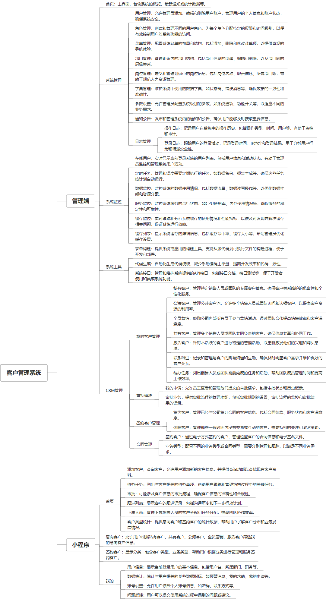

 

    
 

公司拥有上百套具有自主知识产权的软件系统，详情请查看码云首页或公司官网

 
<h1>客户管理系统</h1>

<a href="https://www.haishi.net.cn/">公司官网</a> ｜ <a href="https://www.haishi.net.cn/">在线体验</a>

 

## 系统介绍

业务管理、合同管理、客户管理、客户跟进、销售管理、客户激活、代办任务、公海客户等功能
本项目名称为客户管理系统，旨在帮助企业管理和跟踪客户关系，提高客户满意度和销售转化率。该系统适用于拥有大量客户需要维护的企业，例如销售型企业、服务型企业等。它主要包括客户管理、合同管理、审批管理、数据统计等模块。该系统可以帮助企业全面管理客户信息，跟踪客户互动，提高客户留存率，并通过数据分析优化业务流程。
本项目从用户层面可以分为两个端：管理端和 小程序端。
- 管理端：公司内部管理员用户使用，可以进行用户管理、角色管理、客户管理、合同管理、审批管理、系统监控等。
- 小程序端：外部客户或内部员工使用，可以进行添加客户、查询客户、查看待办任务、审批申请、查看跟进列表、查看下属人员、查看数据统计等。
                

## 系统功能介绍

### 系统包含终端说明

管理端（WEB）、用户端（微信小程序）

| 序号 | 模块                | 模块说明 |
| ---- | ------------------- | -------- |
| 1    | QHY-CRM-RLZY-MANAGE | 管理端   |
| 2    | QHY-CRM-RLZY-SERVER | 服务端   |
| 3    | QHY-CRM-RLZY-MP     | 小程序   |

### 系统功能结构

### 系统功能说明

- CRM管理：本系统核心功能模块，包含意向客户管理、签约客户管理、合同管理以及业务类型管理,根据客户类型进行精细化管理，并追踪记录客户转化过程。
- 审批模块：提供业务流程线上审批功能，例如合同审批、费用审批等，提高业务审批效率。
- 数据统计：对客户数据、业务数据进行统计分析，为管理决策提供数据支撑。

## 系统主要界面

## 系统技术说明

### 代码模块说明

| 序号 | 目录                              | 目录说明 |
| ---- | --------------------------------- | -------- |
| 1    | QHY-CRM-RLZY-SERVER/crm-generator | --       |
| 2    | QHY-CRM-RLZY-SERVER/crm-quartz    | --       |
| 3    | QHY-CRM-RLZY-SERVER/crm-core      | --       |
| 4    | QHY-CRM-RLZY-SERVER/crm-system    | --       |
| 5    | QHY-CRM-RLZY-SERVER/crm-common    | --       |
| 6    | QHY-CRM-RLZY-SERVER/crm-admin     | --       |
| 7    | QHY-CRM-RLZY-SERVER/crm-framework | --       |

### 系统技术选型

#### 开发语言/框架

JAVA（JDK1.8）
前端框架：VUE2
脚手架：RuoYi
系统结构：单体应用

#### 服务中间件

Nginx
Tomcat

#### 数据库

MySQL（5.7+）
Redis

#### 其他说明

无

## 系统演示/商用

请扫码添加客服微信获取演示地址和系统详细资料。

如果您想基于客户管理系统进行商业化交付或定制开发服务，我们提供有偿的技术服务支持，合作模式不限，欢迎沟通！

公司官网地址： <a href="https://www.haishi.net.cn/">https://www.haishi.net.cn</a>

联系客服获取专业回答。

## 使用须知

1、 本项目商用必须获得版权所有者的授权。

2、 未经允许本项目代码不允许二次出售。

